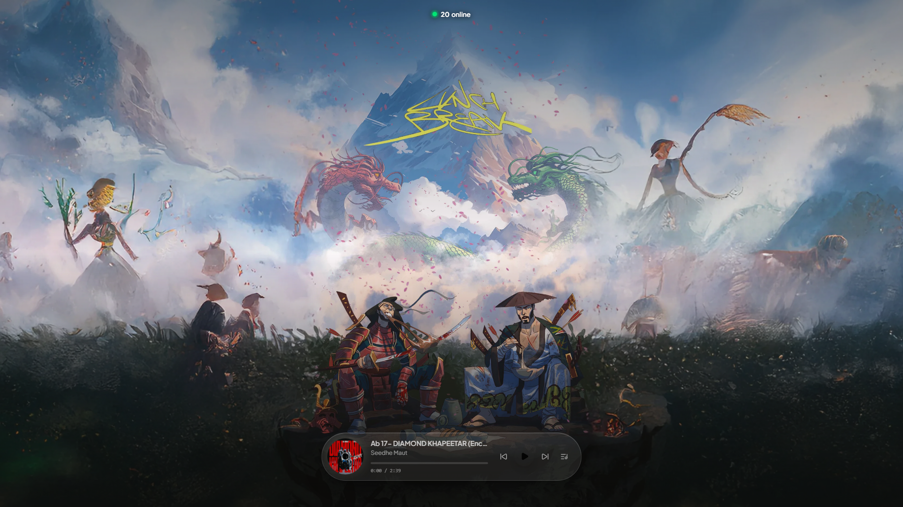

# 🎧 Seedhe Maut Music Player (`seedhemaut.fm`)

A high-performance web music player built around the visual world, soundscapes, and comprehensive discography of **Seedhe Maut (TBSM)**.



---

## 🌟 Project Overview

This project is a React 19 + Vite music player designed as an immersive, dedicated listening experience for Seedhe Maut. The interface features a permanent, high-resolution *Lunch Break* aesthetic with a responsive audio engine, spinning vinyl record, dynamic aura lighting per track, instant search, and native mobile lockscreen media controls.

> **Note**: Private tribute project. All music and artistic rights belong to Seedhe Maut, DL91, Azadi Records, and respective producers/collaborators.

---

## 🎵 Master Discography (158 Tracks)

The player catalogue contains **158 curated tracks** spanning Seedhe Maut's history from underground beginnings to 2026:

* **Bayaan Era (2018–2019)**: *Class-Sikh Maut Vol. II*, *Kranti*, *Shaktimaan*, *Pankh*, *Gehraiyaan*, *Meri Gully Mein (Encore ABJ)*, *Kashmakush*.
* **Post-Bayaan & Singles (2019–2021)**: *101*, *Nadaan*, *Dum Pishaach*, *Namastute*, *Nawazuddin*, *Chalo Chalein*, *Yaad*.
* **Nayaab Era (2022)**: Complete 17-track masterpiece with Sez on the Beat (*Nayaab*, *Anaadi*, *Maina*, *Dum Ghutte*, *Gandi Aulaad*, *Kohra*, *Rajdhani*, *Batti*, *Teen Dost*).
* **Lunch Break Era (2023–2024)**: Complete 30-track mixtape (*11K*, *Sick & Proper*, *Brand New*, *Luka Chippi*, *Taakat*, *Asal G*, *Swah!*, *Khoon*, *Kavi*, *W*).
* **Calm Solo Works**: Complete *PentHouse Tapes Vol. 1* (*BUN MASKA*, *KHO KHO*, *BAM BAM*, *PISHA*, *RED CUP*, *ROOTS*, *RELAX*).
* **Encore ABJ Solo Works**: Complete *EE* EP (*ALL CAPS*, *Neelam Aur Neeli*, *Elevator Music*, *Kya Mai Yaha*, *Masti*, *Crash Out*).
* **Latest 2026 Singles & Collaborations**: *Dilli Jale Roz*, *So Exotic*, *Sangeet*, *DOMINOS*, *Holi Re Rasiya*, *Stadium Coupe*, *Diamond Khapeetar (Remix)*.

---

## ✨ Features & Architecture

* **Realistic Spinning Vinyl**: 60fps rotational physics with continuous angular velocity and deceleration on pause.
* **Dynamic Neon Auras**: Soft glowing ambiance and color accents calibrated dynamically for every song.
* **Instant Drawer Search**: Real-time fuzzy filtering across all 158 tracks with 0ms keystroke lag.
* **Permanent Lunch Break Environment**: High-resolution wallpaper locked in the background with subtle ambient idle motion.
* **Mobile & Lockscreen Integration**: Full MediaSession API support (`navigator.mediaSession`) for lockscreen playback controls, album art, and notification widgets.
* **High-Performance Audio**: Range-request AAC streaming with opportunistic zero-latency next-track preloading.
* **Lightweight Bundle**: Gzipped client application bundle of only `15.2 kB` with standalone vendor code chunking.

---

## 🛠️ Tech Stack

* **Framework**: React 19 + Vite 8
* **Styling**: TailwindCSS v4 + Glassmorphism UI
* **Icons**: Lucide React
* **Audio Engine**: HTML5 Audio + Web Audio API + MediaSession API
* **Deployment**: Vercel (`https://lunch-break-player.vercel.app`)

---

## 🚀 Local Development

```bash
# 1. Clone the repository
git clone https://github.com/divyprj/lunch-break-player.git
cd lunch-break-player

# 2. Install dependencies
npm install

# 3. Start local development server
npm run dev

# 4. Build for production
npm run build
```

---

## 🌐 Canonical URLs
* **Production Deployment**: [https://lunch-break-player.vercel.app](https://lunch-break-player.vercel.app)
* **Custom Domain**: [https://seedhemaut.fm](https://seedhemaut.fm)
